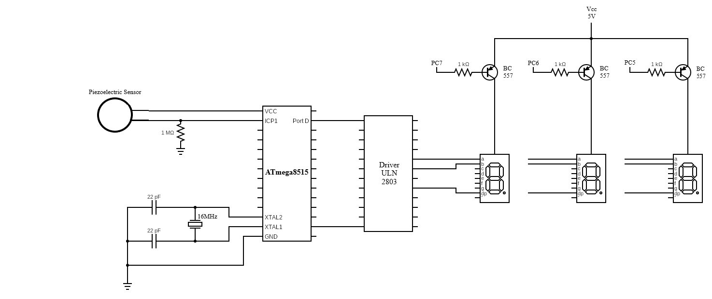

# drum_reference_metronome
Program to calculate the tempo of a real-time drum beat

## Getting Started

### Requirements
* AtmelStudio IDE
* ATmega8515 microcontroller
* Driver ULN 2803
* 7-segment displays (x3)
* Piezoelectric Sensor
* 16 MHz Crystal Oscillator

### Installing
1. Connect 7-segment displays, piezoelectric sensor, and crystal to the ATmega8515 microcontroller as shown in the following diagram:
   
1. Open AtmelStudio and create new project
   * Choose ATmega8515 device
1. Add drumReferenceMetronome.c file to project
1. Build target
1. Write the resulting hex file to the ATmega8515 microcontroller

### Example

Tapping the piezoelectric sensor we get the tempo in beats per minute.

## Authors

* **Sahil Mahajan**

## License

This project intentionally has no license.
